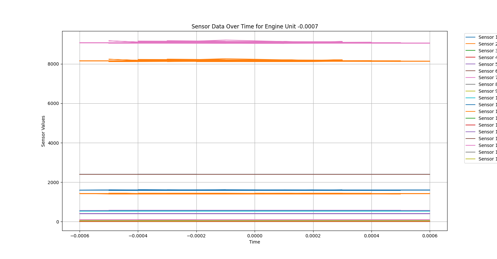
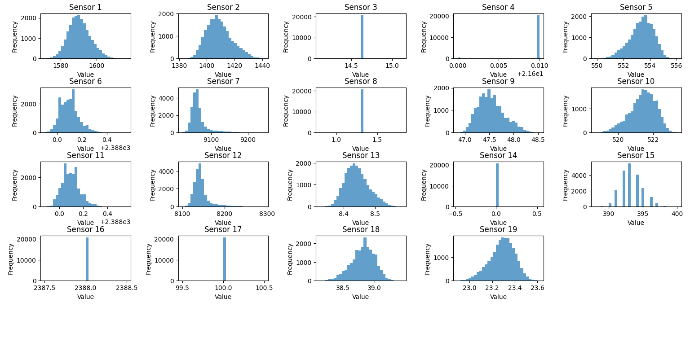

# NASA Prognostics Week 1

## Project Description
This repository contains the code and documentation for analyzing engine sensor data from the NASA Prognostics Data Repository. The project involves data preprocessing, exploratory data analysis (EDA), and initial insights into the sensor measurements.

## Project Overview
The dataset includes sensor measurements from 100 engine units with various operational cycles. Key files include `train_FD001.txt`, `test_FD001.txt`, and `RUL_FD001.txt`.

## Steps in Preprocessing
1. **Reading and Cleaning Data**: Initial steps to handle missing values and ensure data consistency.
2. **Aggregating Sensor Data**: Aggregation by operational units for analysis.
3. **Generating Visualizations**: Creating plots to understand data patterns.

## Visualizations
- **Sequence of Time Plot**: Displays sensor readings over time for selected engine units.
- 
- **Sensor Histogram**: Shows the distribution of sensor measurements across all data points.
- - 
